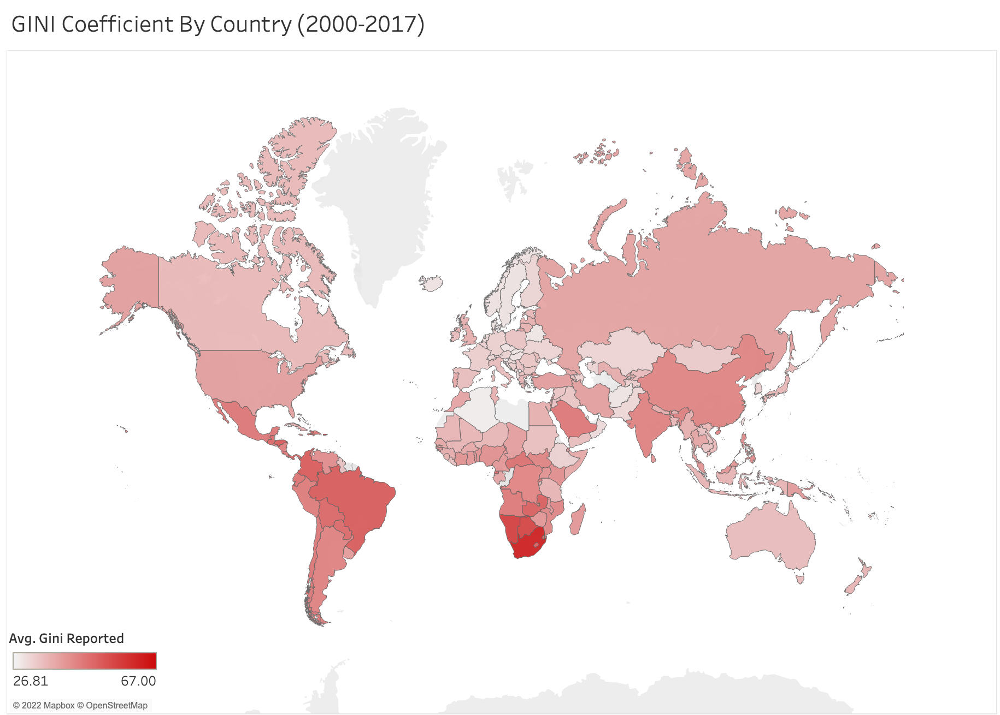

### Part 1

## Gini Visualization

Here, I visualize the mean GINI coefficient for every country included in the WIID dataset from 2000-2017 using a world map. The GINI coefficient is a value used to measure income inequality within a certain group, often countries. I choose to represent the range of the GINI coefficients for each country using a red gradient, with countries on the lower end of the spectrum more white and countries on the higher end of the spectrum a darker red. I choose not to group countries by region because the GINI data often varied between countries in the same region, so I found it valuable to represent the value for each specific country. Looking at the map, you can clearly see that countries in southern Africa and South America have the highest GINI coefficients. 

Design wise, I choose to represent this data on a map as the specific GINI values are less significant than their relative values to other countries. Given that all countries are included in this dataset, if I were to have used a bar chart, or labeled each country with its specific GINI value, the visualization would have quickly become messy. Additionally, I made the decision to use a red gradient to represent this range given that the color red is often associated with negative traits, so the audience would be more likely to understand that countries on the darker end of the spectrum have higher rates of inequality even if they are unfamiliar what the GINI coefficient actually calculates. 

When filtering the data, I decided to only use points from 2000-2017, as that paints the most accurate picture of the current status of inequality globally. Additionally, I choose to only include data points with an “areacovr” value of “all” because I wanted to only include points gathered from all types of land, not just "Urban" or "Rural." Also, for most {courtry, year} groups of data points, at least one of those points had a value of "all" for "areacovr," so by filtering out "Urban" and "Rural" I was able to avoid duplicates.

## Median Income Visualization

In the above visualization, I illustrate the average median income from 2000-2017 for each global subregion, highlighting the larger regions those subregions fall within. Median income represents the income that falls in the middle of the range of all incomes within a specific country. I choose to use the median rather than the mean for this visualization to avoid outliers skewing the data (a small group of people with a significantly higher income than the rest of the population will affect the mean to a much greater degree than the median). I grouped this data by two measures: Region and Subregion, each defined by the United Nations. Subregion presents a clearer picture of how much the average citizen in different sections of the world earns, as each sub-region includes fewer data points than region. However, I also choose to use colors to illustrate region groups to demonstrate which regions fall on one end of the spectrum versus the other. This mainly served to show that European countries tend to have the highest median incomes, while African countries tend to have the lowest. Countries in the Americans tend to lie somewhere in the middle, although North America is an outlier with the highest median income of all subregions. 

In terms of design, I choose to represent the data on a bar chart to give the audience the best idea of both the specific values of each subregion, as well as their relative values to other subregions. While I could have grouped by country using a world map, I thought the notable difference between subregions was valuable, and the bar chart allows the audience to better grasp the actual income value for each region--it is easier to read values on a bar chart than it is to read values represented by a gradient map. Additionally, I choose to put the highest values on the left and the lowest on the right so that the audience can clearly see which region's citizens earn the most, and which earn the least. I also used soft, light colors so that the audience is not overwhelmed by the image being presented to them. 

Like with GINI, I choose to filter the data using points only from 2000-2017 to present an accurate depiction of the current economic status of these regions. 

## GDP Visualization

The above visualization illustrates the average GDP per capita from 2000-2017 for each global subregion, also highlighting the larger regions those subregions fall within. GDP per capita is used to measure the average economic output of a citizen in a given country. It is calculated by dividing a country's total GDP by its number of citizens. Like with median income, I choose to group this data by subregion and region to paint a picture of both the average GDP by subregion as well as trends in the larger regions. I decided to include this graph in addition to the median income graph because it paints a better picture of a country's total economic output as a whole. By viewing this in conjunction with the median income graph, it is possible to see which region's citizens are on net earning a greater proportion of the per capita output than others. It is especially interesting to note that the GDP chart is significantly less skewed to the left than the median income graph, indicating that citizens in poorer countries tend to earn a smaller share of their economic output than richer countries. 

Like with the income graph, I choose to use a bar chart sorted from highest values to lowest to give the audience an idea of both the specific GDP per capita values and the relative values to other countries. By allowing the audience to easily perceive the relative GDP values between countries, they are able to better understand how the relative GDP per capita differs from the relative median income, painting a clearer picture of inequality. I used the same soft colors as I did in the median income graph to remain consistent and present a visualization pleasing to the audience. 

I also filtered this data from 2000-2017 to present a more current image of global inequality. 

## Quintile Visualization

In the above visualization, I plot the average quintile shares of resource for each subregion from 2000-2017. Quintile shares of resource measure the percent share of a country's total income that each economic group, divided into fifths, holds. For example, if Q1 for a specific country is equal to 7%, that means that the poorest 20% of a population earns 7% of the country's total income. I choose to group these values by subregion rather than by country because the graph would have been extremely messy had I tried to represent Q1 through Q5 for each country. Additionally, I found enough variability between subregions to justify grouping the data in this way.

I choose to represent the data on a bar chart because this allows the audience to visualize both the relative quintile shares of a resource between subregions and the specific values that each quintile holds for each subregion. The audience can visually see what proportion of a country's total income each economic group holds. Additionally, I sorted the data by Q5, the richest 20% of a population, from highest to lowest because I thought that was a strong marker for the level of inequality within a region. This allows the audience to see that the richest 20% of regions like southern African, central America, and southern America earn more proportionally to the poorest 80% than in regions in Europe, a conclusion corroborated by the GINI map. 

Additionally, I chose to represent each quintile as a shade of blue rather than using multiple colors for two reasons. First, although different quintiles represent different groups of a population, they measure the same value: share of total income. Second, I did not want to confuse the viewer with an abundance of colors.

Like with the other charts, I only used points from 2000-2017 to represent the current status of global inequality. I also choose to only include points with a "popcovr" value of "all," as I did not want to include points that did not account for all groups of a population (as opposed to points with a "popcovr" value of "rural" or "urban").
